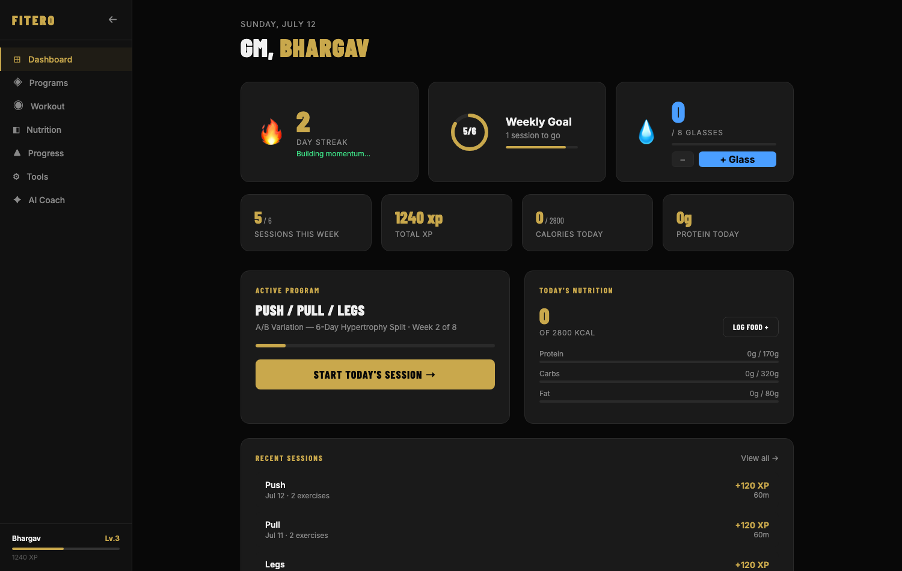
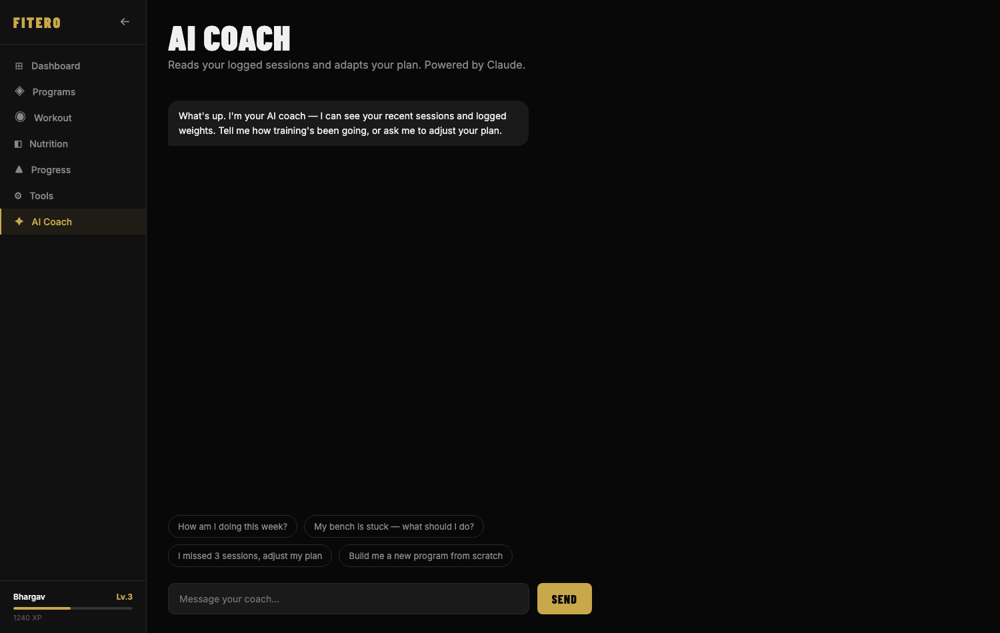
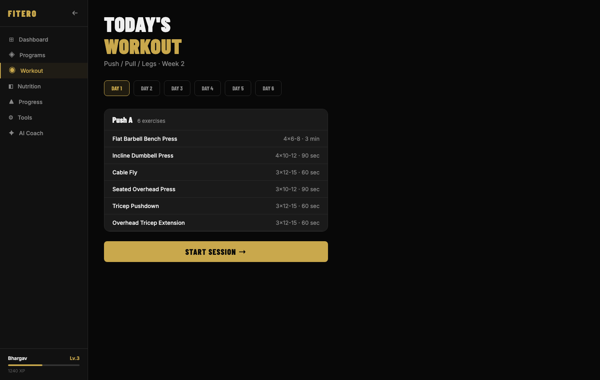

# Fitero 🏋️ — an AI fitness coach that *does things*

> Not a chatbot that talks about workouts — an agent that creates your plan, logs your sessions, watches your progress, and books your training into Google Calendar.

[](https://github.com/Gutta09/fitero/actions/workflows/ci.yml)
[](LICENSE)



## The agent

The coach is a Claude tool-calling loop (`src/agent/loop.ts`) over five real tools:

| Tool | What it actually does |
|---|---|
| `create_workout_plan` | Builds a goal/level-appropriate weekly split from a curated exercise bank and saves it to SQLite |
| `log_workout` | Persists a completed session (exercises, sets, reps, weight) |
| `get_progress` | Reads training history + the active plan back into the conversation |
| `adjust_plan` | Compares planned vs. logged volume and adapts next week up or down |
| `add_to_calendar` | Creates real Google Calendar events for upcoming sessions (OAuth, see [SETUP_CALENDAR.md](SETUP_CALENDAR.md)) |

Tool inputs are zod schemas compiled to JSON Schema (`src/tools/schemas.ts`) — the same definition validates at runtime and documents the tool to the model. The loop handles **parallel tool calls** (all `tool_result`s returned in a single message, as the API requires), marks failed tools with `is_error` so the model can recover, and caps tool iterations as a runaway guard. Conversation history is bounded and always trimmed on a plain user-turn boundary so no orphaned `tool_result` ever leads the transcript.

A design choice worth knowing: **plan generation is deterministic code, not LLM output.** The model decides *when* to create a plan and for *what* goal/level; the actual sets/reps/rotation come from a curated exercise bank. Coaches don't improvise programming from scratch, and neither should the agent — it means every generated plan is sane, and the LLM's job is conversation + orchestration.

The frontend also feeds **live training data** (current streak, weekly goal, recent sessions) into the agent's system prompt on every chat turn, so "how am I doing?" is answered from your actual numbers.

## The app

React 19 + Vite + TypeScript client (`client/`): onboarding, program picker, guided workout player with a Web-Worker rest timer (keeps ticking when the tab is backgrounded), exercise form cues, nutrition log, progress charts (recharts), streak + weekly-goal ring dashboard. Client state lives in localStorage (`fitero_*` keys); the coach page talks to the Express API.

| Coach (agent chat) | Workout player |
|---|---|
|  |  |

## Run it

Prereqs: Node 20+, an Anthropic API key.

```bash
npm install && npm install --prefix client

cp .env.example .env      # add ANTHROPIC_API_KEY
npm run dev               # API on :3001 + client on :5173
```

Optional: Google Calendar sync — see [SETUP_CALENDAR.md](SETUP_CALENDAR.md).

```bash
npm test                  # vitest: agent loop (mocked LLM), plan generation, schemas, history trimming
npm run typecheck         # backend + client
```

The model defaults to `claude-sonnet-4-6`; override with `ANTHROPIC_MODEL` in `.env`.

## Design notes / honest limitations

- **Single-user by design.** One person, one machine: conversation history is in-process, the SQLite file sits next to the code, and there's no auth. That's the right shape for a personal tool; multi-user would need sessions, auth, and per-user data scoping.
- The Google Calendar OAuth flow is CLI-based on first run (paste a code) — fine for a personal tool, not a hosted product.
- Client state (programs, streaks, nutrition) is localStorage-only and separate from the agent's SQLite store; the two meet in the live-context bridge, not a shared database.

## License

[MIT](LICENSE)
